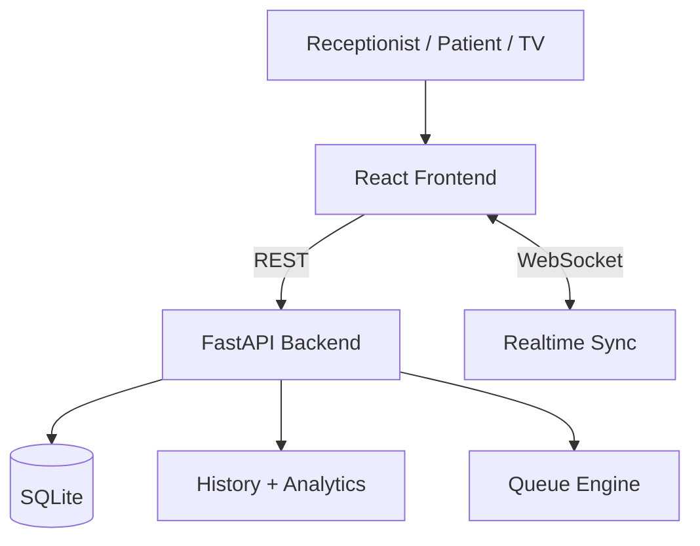
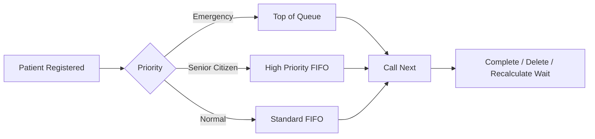
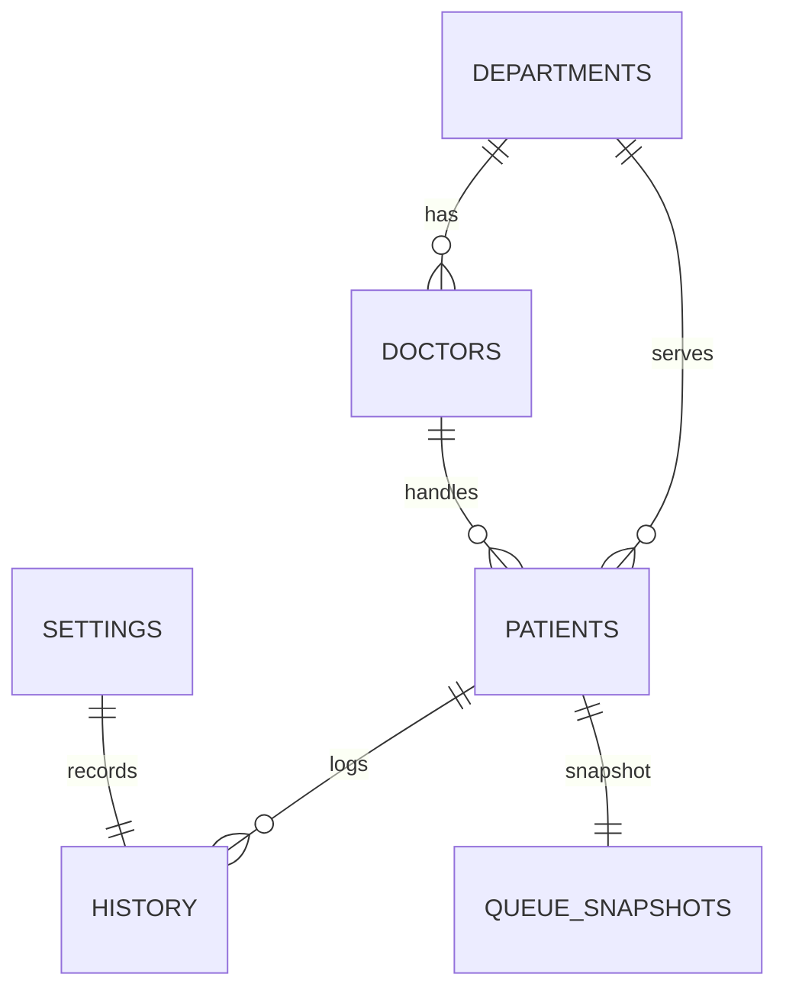
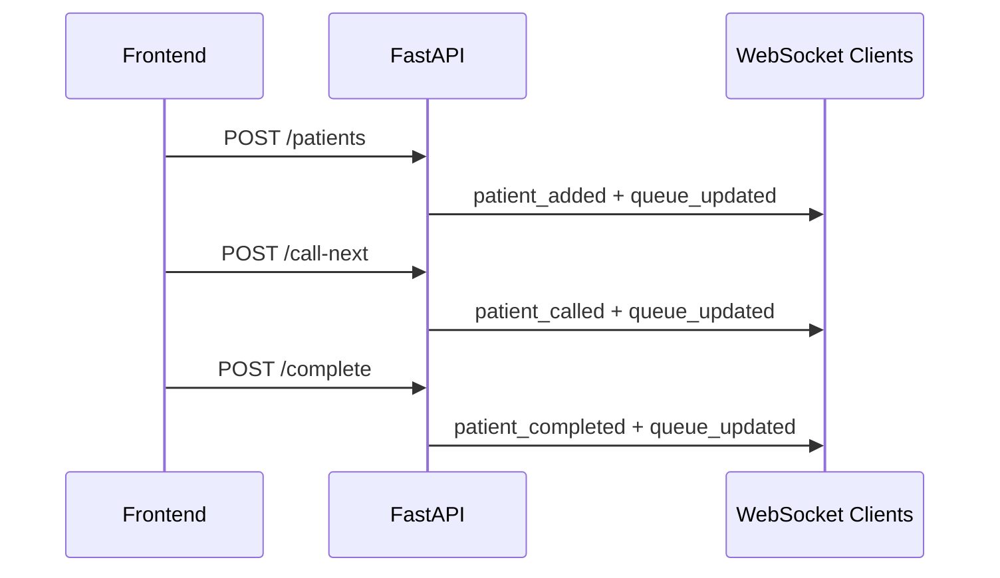
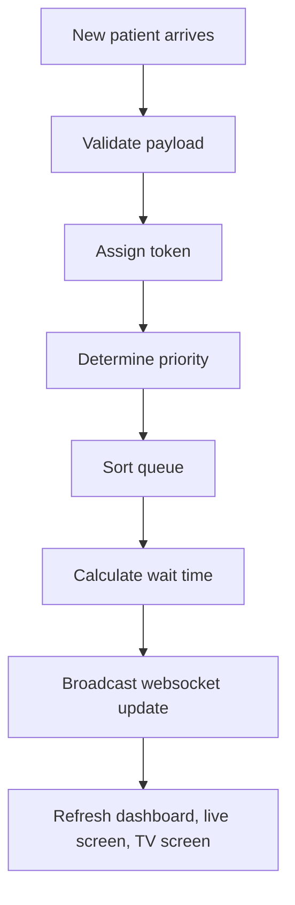
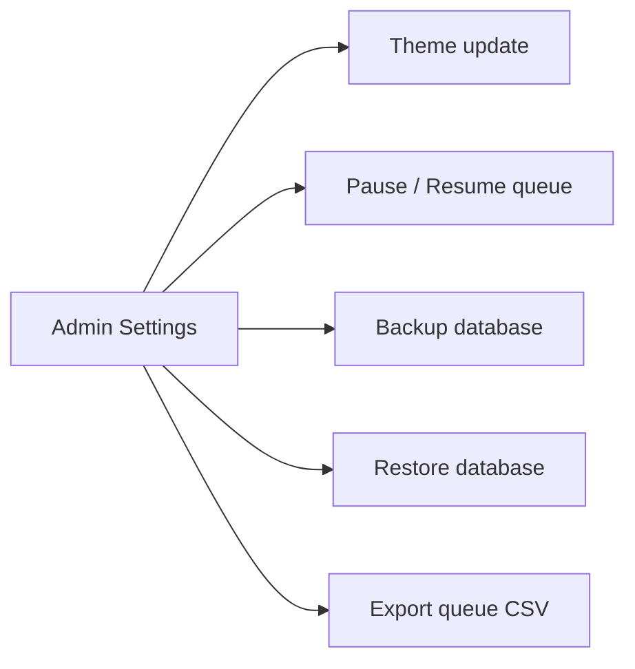

# Architecture Diagrams

## Architecture Diagram


```mermaid
graph TD
  U[Receptionist / Patient / TV] --> F[React Frontend]
  F -->|REST| A[FastAPI Backend]
  F <-->|WebSocket| W[Realtime Sync]
  A --> D[(SQLite)]
  A --> H[History + Analytics]
  A --> Q[Queue Engine]
```

## Flow Diagram


```mermaid
flowchart LR
  A[Patient Registered] --> B{Priority}
  B -->|Emergency| C[Top of Queue]
  B -->|Senior Citizen| D[High Priority FIFO]
  B -->|Normal| E[Standard FIFO]
  C --> F[Call Next]
  D --> F
  E --> F
  F --> G[Complete / Delete / Recalculate Wait]
```

## Database ER Diagram


```mermaid
erDiagram
  DEPARTMENTS ||--o{ DOCTORS : has
  DEPARTMENTS ||--o{ PATIENTS : serves
  DOCTORS ||--o{ PATIENTS : handles
  PATIENTS ||--o{ HISTORY : logs
  PATIENTS ||--|| QUEUE_SNAPSHOTS : snapshot
  SETTINGS ||--|| HISTORY : records
```

## WebSocket Event Diagram


```mermaid
sequenceDiagram
  participant UI as Frontend
  participant API as FastAPI
  participant WS as WebSocket Clients
  UI->>API: POST /patients
  API->>WS: patient_added + queue_updated
  UI->>API: POST /call-next
  API->>WS: patient_called + queue_updated
  UI->>API: POST /complete
  API->>WS: patient_completed + queue_updated
```

## Queue Engine Diagram


```mermaid
flowchart TD
  A[New patient arrives] --> B[Validate payload]
  B --> C[Assign token]
  C --> D[Determine priority]
  D --> E[Sort queue]
  E --> F[Calculate wait time]
  F --> G[Broadcast websocket update]
  G --> H[Refresh dashboard, live screen, TV screen]
```

## Admin Operations Diagram


```mermaid
flowchart LR
  A[Admin Settings] --> B[Theme update]
  A --> C[Pause / Resume queue]
  A --> D[Backup database]
  A --> E[Restore database]
  A --> F[Export queue CSV]
```
```